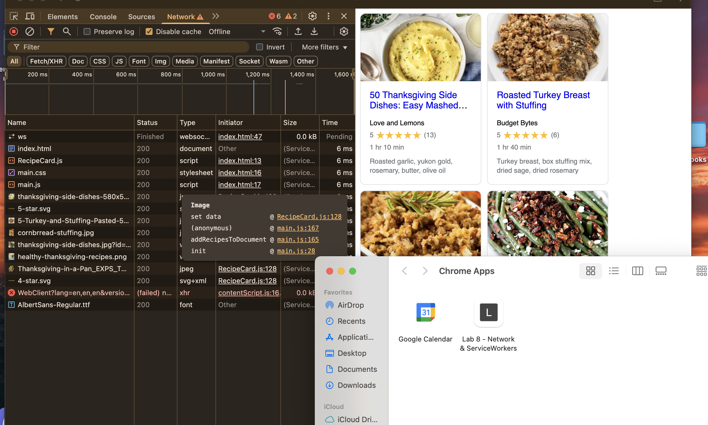

# Lab8-Starter

Graceful Degradation Quesiton Lab 8:

The principle of Graceful degradation is having a product that for the most part is able to function normally under less-than-ideal conditions. Service workers are a great way to implement this concept into web apps because they allow websites to remain up and running under poor internet connectivity through caching data while the webpage was connected to the internet.

GH Pages Link:

https://vedantpatel04.github.io/Lab8_Starter/